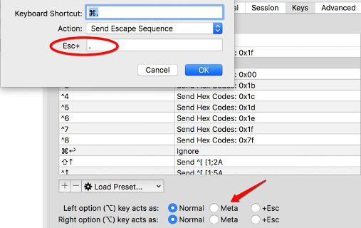
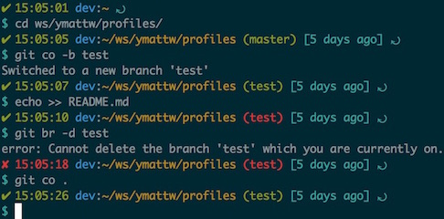
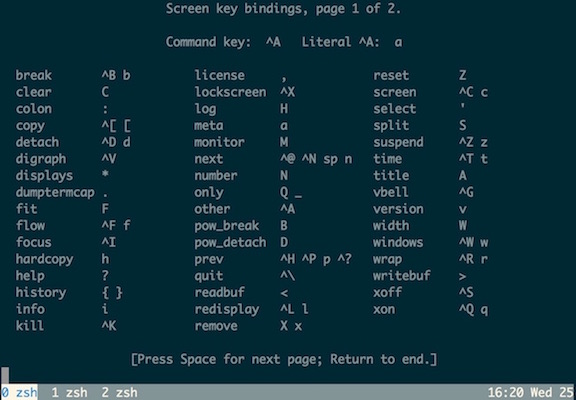
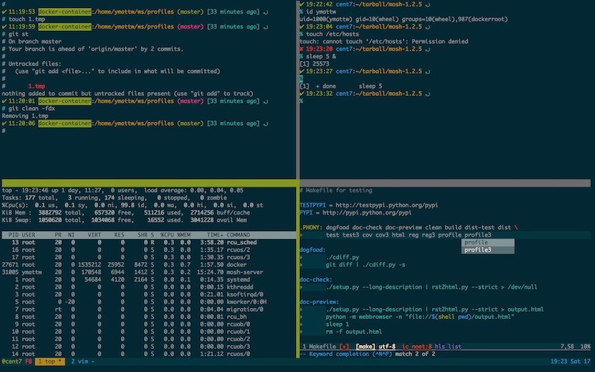

class: center, middle

# Productivity Tools


Matthew Wang

<small>
Last updated: May 24, 2016<br>
[github.com/ymattw](https://github.com/ymattw)
</small>

---

class: center, middle

## Preface

Why tools matter

---

## Outline

- Readline
- Ssh config
- Git config
- Shell config
- Screen / tmux
- Vim plugins

---

class: center, middle

## Readline

Speed up your command typing

---

### GNU readline

[Readline](https://cnswww.cns.cwru.edu/php/chet/readline/rltop.html) is not
a command, it's a library for line editing used by most command line
interfacing tools.  Try in bash and mysql session.

Cursor moving:

```
C-a
    Moves the cursor to the line start (key Home)

C-e
    Moves the cursor to the line end (key End)

Alt-b
    Moves the cursor backward one word

Alt-f
    Moves the cursor forward one word
```

---

### GNU readline (cont.)

Line editing:

```
C-w
    Clears the word before the cursor

C-u
    Clears the line content before the cursor

C-d
    Delete the character underneath the cursor.

C-x C-e
    Edits current line with $EDITOR, or vi if undefined

C-r
     Reverse search command in history, a second Ctrl+r repeats

C-s
    Go back to the next more recent command of the research
    (Pro tip: Add test -t 0 && stty stop undef to your .bashrc)
```

---

### GNU readline (cont.)

```
Meta-. (Alt-.) or ESC-.
    Insert the last argument of the previous command
```

Tip for iTerm user (Preference > Profile > Keys):

<center>

</center>

Ref: https://en.wikipedia.org/wiki/GNU_Readline

---

class: center, middle

## Ssh config

Never type password again

---

### Ssh key

Setup a key-pair if you haven't, secure it with a **passphrase**!

```bash
ssh-keygen -t rsa -b 2048
```

Install it to remote host

```bash
ssh-copy-id user@host
```

_But it asks me to input passphrase everytime?_

---

### Use ssh with an agent

3 ways to invoke the daemon

- `ssh-agent bash`
- `eval $(ssh-agent)`
- `ssh-agent > ~/.ssh-agent.rc && source ~/.ssh-agent.rc`

Add key (asks passphrase once)

- `ssh-add [~/.ssh/id_rsa]`

Use (ssh will ask the agent for the key)

- `ssh user@host`

---

### Save ssh options in config file

Do you type this often?

```
ssh -l ymattw -p 2200 -i ~/.ssh/ymattw.key 192.168.1.2
```

Use ~/.ssh/config

```
Host dev
    Hostname 192.168.1.2
    Port 2200
    Username ymattw
    IdentityFile ~/.ssh/ymattw.key

Host *
    User me
```

Now just type `ssh dev`

See all options: `man ssh_config`

More tips see https://ymattw.github.io/ssh-essential/

---

class: center, middle

## Git config

Make version control easier

---

### Git alias

Less key strokes:

```bash
git config --global alias.st status
git config --global alias.ci commit
git config --global alias.info "remote -v show -n"
git config --global alias.br branch
git config --global alias.co checkout
```

See more in my [gitconfig.sh](https://github.com/ymattw/profiles/blob/master/git/gitconfig.sh).

---

### Useful config

```bash
# Use vim to edit commit log
git config --global core.editor vim

# Be colorful
git config --global color.ui true

# Use short commit hash
git config --global log.abbrevcommit true

# Show readable symbol for comm
git config --global log.decorate short

# Show foo/bar.c instead of [ab]/foo/bar.c
git config --global diff.noprefix true
```

See more in my [gitconfig.sh](https://github.com/ymattw/profiles/blob/master/git/gitconfig.sh).

---

class: center, middle

## Shell config

Saves your fingers

---

### Bash PS1

Do you often type `pwd`, `git status`, `git branch` from bash command line?

Or often type `echo $?` to tell exit status from last command?

Let $PS1 do that automatically!



---

### Customize .bashrc

Refer to [Controlling the Prompt](https://www.gnu.org/software/bash/manual/bashref.html#Controlling-the-Prompt)

```
\h  The hostname, up to the first '.'
\H  The full hostname
\t  The time, in 24-hour HH:MM:SS format
\T  The time, in 12-hour HH:MM:SS format
\u  The username of the current user
\w  The current working directory
\W  The basename of $PWD
\$  If the effective uid is 0, #, otherwise $
```

---

### Special notes

Want ANSI color?  Refer to [ANSI escape code](https://en.wikipedia.org/wiki/ANSI_escape_code).

```
\e[31m denotes foreground red
\e[0m  resets ansi color
```

Cool, but note you need to <span class="red">surround
non-printable chars with `\[` and `\]`</span>, otherwise your command
line will be in a mess when it is wrapped to next line!

```
\]
    Begin a sequence of non-printing characters. This could be used to
    embed a terminal control sequence into the prompt.

\]
    End a sequence of non-printing characters.
```

---

### Bash PS1 example

Example:

```bash
PS1="\$([[ \$? == 0 ]] && echo '${_DG}✔' || echo '${_DR}✘') \t "
...
PS1="${PS1}$(hostname -f)"
PS1="${PS1}:\[\e[33m\]\w\[\e[0m\]"  # yellow cwd
PS1="${PS1}\$(_git_active_branch)"  # git branch name
```

You can do much more.  See also

- My [bashrc](https://github.com/ymattw/profiles/blob/master/bash/bashrc#L185-L219)
- [powerline](https://github.com/powerline/powerline) - powerful collection of
  prompt

---

### Zsh

[zsh](https://en.wikipedia.org/wiki/Z_shell): Shell for Pros

- Powerful completion
- Sharing history among all instances
- Spell correction
- Themeable prompts
- Loadable modules

Refs:

- [What are the cool features of zsh that beat other
  shells?](https://www.quora.com/What-are-the-cool-features-of-zsh-that-beat-other-shells)
- My [zshrc](https://github.com/ymattw/profiles/blob/master/zsh/zshrc)

---

### Fish shell

[fish](https://fishshell.com/): Finally, a command line shell for the 90s (not
for me :-)

- Syntax highlighting
- Autosuggestions
- Sane Scripting
- (90s want to be cool)

---

class: center, middle

## Screen / tmux

You need only one terminal window

---

### Case study

You are restoring your database from a backup, it won't complete in an hour,
and suddenly

1. Your wireless network is down and you lost connection (and your process was
   killed by SIGHUP), or
2. You realize you have to take off to pick up your kid from school in 5 minutes

You will be regretted not starting your task from a screen/tmux session.

---

### Case study (cont.)

If you started your task from a screen/tmux session:

- For case 1, just **reattach** to the session once your network connection
  restored, your task were continued there on server and the output is still
  scrolling!

- For case 2, just **close the lid** of your lap, leave and **reattach** from
  home later, your task will be completed and waiting for you to review by
  then!

---

### Screen

screen - screen manager with VT100/ANSI terminal emulation

- Keep your process running on server with pseudo ttys
- (Re)attach from remote
- Multiple windows (tabs) in one application
- Usually default install on servers

You need this in ~/.screenrc, default setting won't tell you anything.

```
hardstatus alwayslastline '%{WB}%-w%{bW}%n %t%f%{-}%+w %-12=%c %D %d'
```

Remember one key: `C-a ?`

Ref: my [screenrc](https://github.com/ymattw/profiles/blob/master/screen/screenrc)

---

### Screen (cont.)

<center>

</center>

---

### Tmux

tmux - terminal multiplexer

- More powerful than screen
- Split both horizontally and vertically
- Screen share
- Window can be linked to an arbitrary number of session

a) Multiple PuTTy/SecureCRT/X-Shell windows to one server

v.s.

b) One tmux window on server that can split easily

---

### Tmux (cont.)



---

### Tmux (cont.)

Default hot key is `C-b`, e.g. `C-b ?` to get help.

Mostly used keys (press C-b first):

```
"       Split the current pane into two, top and bottom.
%       Split the current pane into two, left and right.
0 to 9  Select windows 0 to 9.
;       Move to the previously active pane.
c       Create a new window.
d       Detach the current client.
n       Change to the next window.
o       Select the next pane in the current window.
p       Change to the previous window.
z       Toggle zoom state of the current pane.
```

Ref: my [tmux.conf](https://github.com/ymattw/profiles/blob/master/tmux/tmux.conf)

---

class: center, middle

## Vim plugins

Be a vim guru

---

### Vim plugin managers

Options

- [pathogen](https://github.com/tpope/vim-pathogen)
- [Vundle](https://github.com/VundleVim/Vundle.vim)
- [vim-plug](https://github.com/junegunn/vim-plug) (recommended)

Example for vim-plug

```vim
Plug 'tpope/vim-markdown', {'for': 'markdown'}
Plug 'hynek/vim-python-pep8-indent', {'for': 'python'}
Plug 'fatih/vim-go', {'for': 'go'}
```

Ref: [What is the difference between the vim package
managers?](http://vi.stackexchange.com/questions/388/what-is-the-difference-between-the-vim-package-managers)

---

### Where to find plugins

Search on [vimawesome.com](http://vimawesome.com/).  Some examples:

Syntax related

- [altercation/vim-colors-solarized](https://github.com/altercation/vim-colors-solarized)
- [tpope/vim-markdown](https://github.com/tpope/vim-markdown)
- [elzr/vim-json](https://github.com/elzr/vim-json)
- [digitaltoad/vim-jade](https://github.com/digitaltoad/vim-jade)

---

### Where to find plugins (cont.)

Programming related

- [moll/vim-node](https://github.com/moll/vim-node)
- [hynek/vim-python-pep8-indent](https://github.com/hynek/vim-python-pep8-indent)
- [fatih/vim-go](https://github.com/fatih/vim-go)
- [Valloric/MatchTagAlways](https://github.com/Valloric/MatchTagAlways)
- [Valloric/YouCompleteMe](https://github.com/Valloric/YouCompleteMe)

Utilities

- [scrooloose/nerdtree](https://github.com/scrooloose/nerdtree)
- [ervandew/supertab](https://github.com/ervandew/supertab)
- [ymattw/AutoComplPop](https://github.com/ymattw/AutoComplPop)
- [godlygeek/tabular](https://github.com/godlygeek/tabular)

See also my [vimrc](https://github.com/ymattw/profiles/blob/master/vim/vimrc).

---

class: center, middle

## Thank you!

[github.com/ymattw/productivity-tools](https://github.com/ymattw/productivity-tools)<br>
[github.com/ymattw/profiles](https://github.com/ymattw/profiles)
